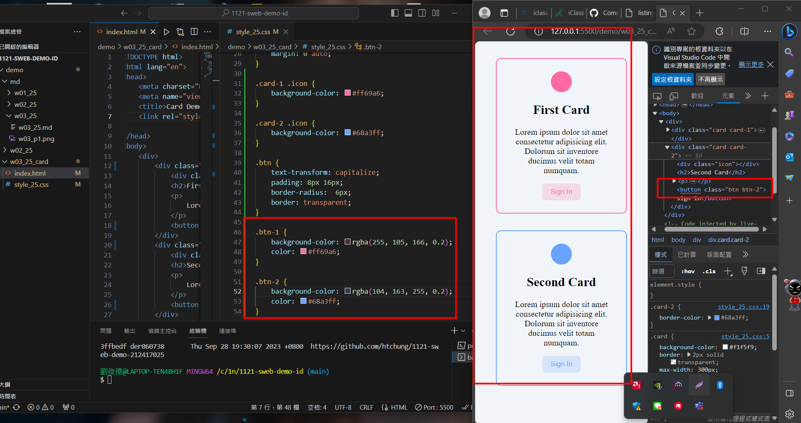
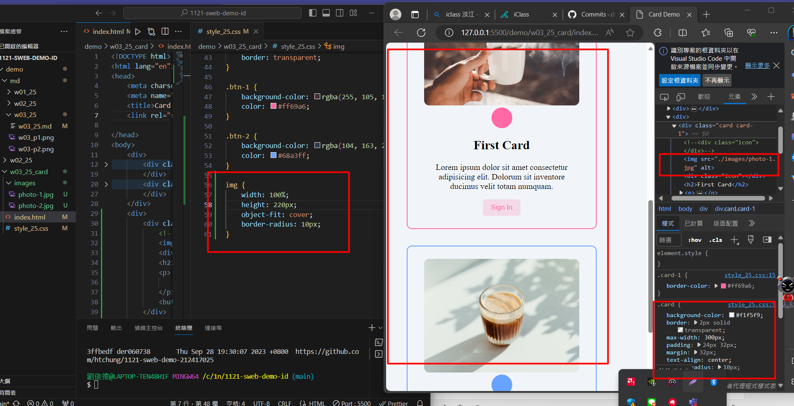
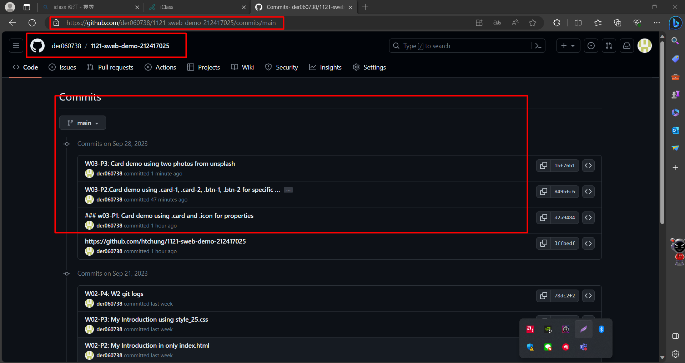

[My Github Repo URL](https://github.com/htchung/1121-sweb-demo-212417025)

### w03-P1: Card demo using .card and .icon for properties
 


```

4175ff3 htchung Thu Sep 28 19:07:09 2023 +0800  W03-P1:Card demo 
using .card and .icon for common properties

```

### W03-P2:Card demo using .card-1, .card-2, .btn-1, .btn-2 for specific properties



```

8b5aab4 htchung Thu Sep 28 20:13:12 2023 +0800  W03-P2:Card demo using .card-1, .card-2, .btn-1, .btn-2 for specific properties

```
### W03-P3: Card demo using two photos from unsplash

 



 

```

57e13e4 htchung Thu Sep 28 20:55:43 2023 +0800  W03-P3: Card demo using two photos from unsplash

```

### W03-P4: W3 git logs

 



 

```

git log --pretty=format:"%h%x09%an%x09%ad%x09%s" --after="2023-09-26"

 

57e13e4 htchung Thu Sep 28 20:55:43 2023 +0800  W03-P3: Card demo using two photos from unsplash

8b5aab4 htchung Thu Sep 28 20:13:12 2023 +0800  W03-P2:Card demo using .card-1, .card-2, .btn-1, .btn-2 for specific properties

4175ff3 htchung Thu Sep 28 19:07:09 2023 +0800  W03-P1:Card demo using .card and .icon for common properties

```