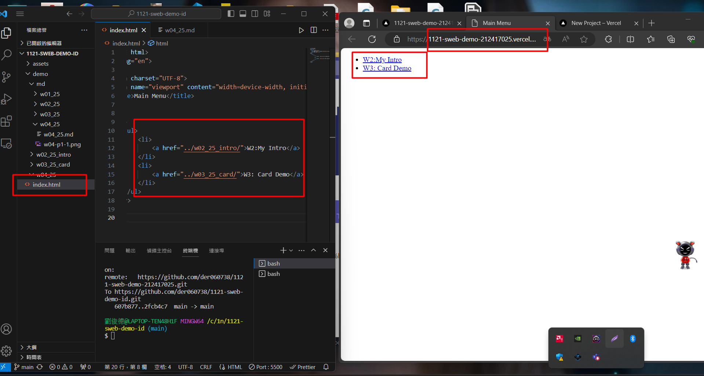
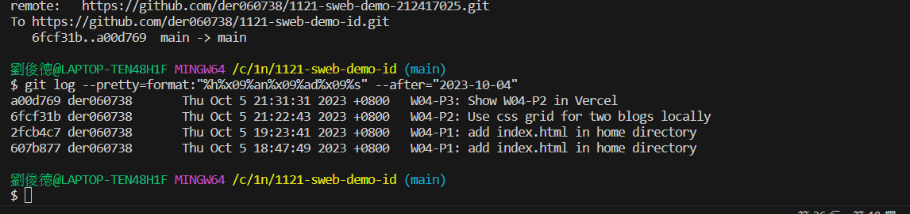

### W04-P1: W04-P1: add index.html in home directory




```

c809ea3 htchung Thu Oct 5 18:35:59 2023 +0800   W04-P1: add index.html in home directory

```
### W04-P2: Use css grid for two blogs locally


```
493759 htchung Thu Oct 5 21:11:11 2023 +0800   W04-P2: Use css grid for two blogs locally

```
### W04-P3: Show W04-P2 in Vercel

 
[Vercel URL](https://1121-sweb-demo-212417025.vercel.app/demo/w04_25_blog/)

 


 
```

0b24906 htchung Thu Oct 5 21:17:28 2023 +0800   W04-P3: Show W04-P2 in Vercel

```
### W04-O4: W4 git logs

 



 

```

git log --pretty=format:"%h%x09%an%x09%ad%x09%s" --after="2023-10-04"

 

0b24906 htchung Thu Oct 5 21:17:28 2023 +0800   W04-P3: Show W04-P2 in Vercel

59a755e htchung Thu Oct 5 21:14:29 2023 +0800   modify index.html to add link

a493759 htchung Thu Oct 5 21:11:11 2023 +0800   W04-P2: Use css grid for two blogs locally

c809ea3 htchung Thu Oct 5 18:35:59 2023 +0800   W04-P1: add index.html in home directory

648cca5 htchung Thu Oct 5 18:30:30 2023 +0800   W04-P1: add index.html in home directory

 

```