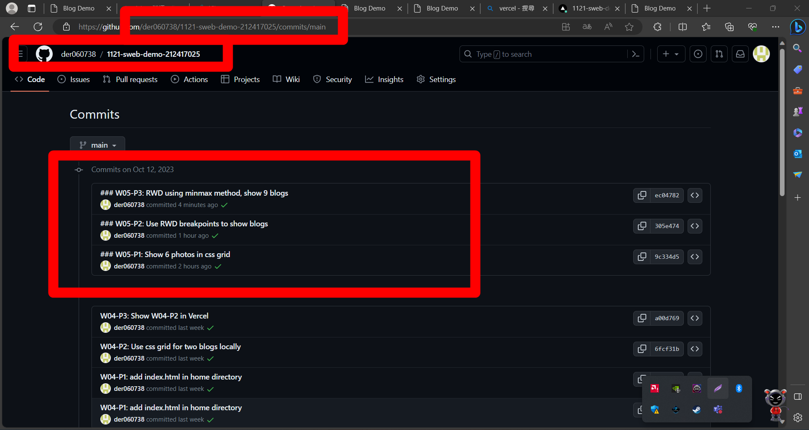

[github repo URL](https://github.com/der060738/1121-sweb-demo-212417025.git)


### W05-P1: Show 6 photos in css grid


```

e3fe8ce htchung Thu Oct 12 18:45:16 2023 +0800  W05-P1: Show 6 photos in css grid

```

### W05-P2: Use RWD breakpoints to show blogs

[Vercel URL](http://127.0.0.1:5500/demo/w05_25_blogs/)


 


 


 


```

7f373b1 htchung Thu Oct 12 19:43:52 2023 +0800  W05-P2: Use RWD breakpoints to show blogs

```

### W05-P3: RWD using minmax method, show 9 blogs

 

[Vercel URL](http://127.0.0.1:5500/demo/w05_25_blogs/)

 


 
```

4a117fe htchung Thu Oct 12 20:41:58 2023 +0800  W05-P3: RWD using minmax method, show 9 blogs

```

### W05-O4: W5 git logs

 



```

git log --pretty=format:"%h%x09%an%x09%ad%x09%s" --after="2023-10-11"

 
4a117fe htchung Thu Oct 12 20:41:58 2023 +0800  W05-P3: RWD using minmax method, show 9 blogs

8fb2045 htchung Thu Oct 12 20:18:07 2023 +0800  add three more blogs, total 9 blogs

f9aad6f htchung Thu Oct 12 19:55:43 2023 +0800  modify index.html to add w05 link

d9cf6f8 htchung Thu Oct 12 19:55:01 2023 +0800  modify index.html to add w05 link

3397312 htchung Thu Oct 12 19:54:17 2023 +0800  modify index.html to add w05 link

7f373b1 htchung Thu Oct 12 19:43:52 2023 +0800  W05-P2: Use RWD breakpoints to show blogs01

e3fe8ce htchung Thu Oct 12 18:45:16 2023 +0800  W05-P1: Show 6 photos in css grid

 

```