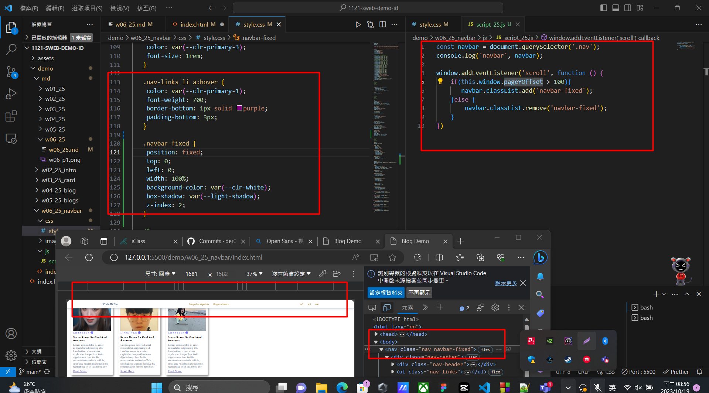

[github repo URL](https://github.com/der060738/1121-sweb-demo-212417025.git)

### W06-P1: Navbar setup with two links to #section-blogs-breakpoints and #section-blogs-minmix

 


 
```
077f42a htchung Thu Oct 19 19:56:43 2023 +0800  W06-P1: Navbar setup with two links to #section-blogs-breakpoints and #section-blogs-minmax

```

### W06-P2: Use js to control when to add or remove .navbar-fixed
 




```

76c6b6d htchung Thu Oct 19 20:45:44 2023 +0800  W06-P2: Use js to control when to add or remove .navbar-fixed

```