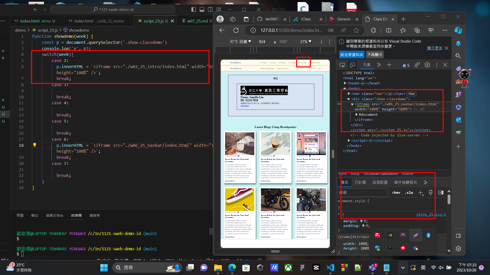
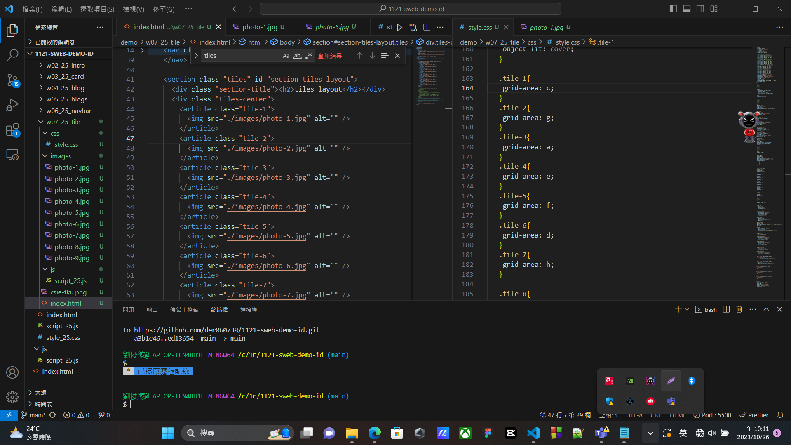
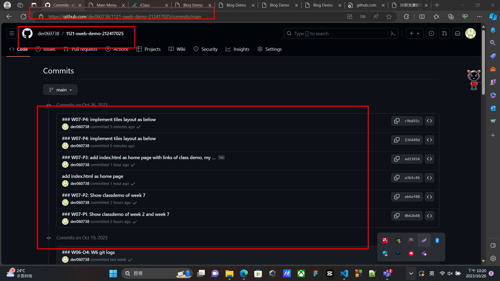

[github repo URL](https://github.com/der060738/1121-sweb-demo-212417025.git)

### W07-P1: Show classdemo of week 2 and week 7
 
#### Week 2
 


#### Week 6
 

 
```
1665470 htchung Thu Oct 26 19:09:54 2023 +0800  W07-P1: Show classdemo of week 2 and week 7
```

### W07-P2: Show classdemo of week 7
 

 
```
f11020d htchung Thu Oct 26 19:44:19 2023 +0800  W07-P2: Show classdemo of week
```

### W07-P3: add index.html as home page with links of class demo, my Github and my Vercel
 

 
```
0ab3832 htchung Thu Oct 26 20:15:25 2023 +0800  add index.html as home page with links of class demo, my Github and my Vercel
```

### W07-P4: implement tiles layout as below
 

 

 
```
3513f76 htchung Thu Oct 26 21:24:34 2023 +0800  W07-P4: implement tiles layout as below
```

### W07-P5: W7 git logs
 

 
```
git log --pretty=format:"%h%x09%an%x09%ad%x09%s" --after="2023-10-25"
 
3513f76 htchung Thu Oct 26 21:24:34 2023 +0800  W07-P4: implement tiles layout as below
0ab3832 htchung Thu Oct 26 20:15:25 2023 +0800  add index.html as home page
f11020d htchung Thu Oct 26 19:44:19 2023 +0800  W07-P2: Show classdemo of week 7
1665470 htchung Thu Oct 26 19:09:54 2023 +0800  W07-P1: Show classdemo of week 2 and week 7
 
```
 