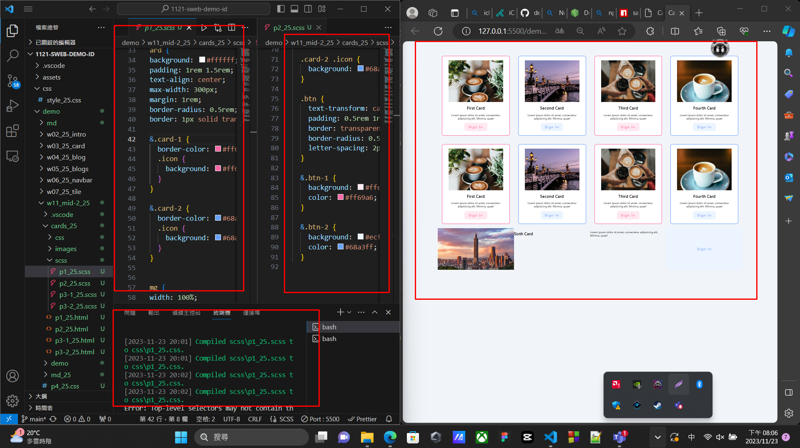
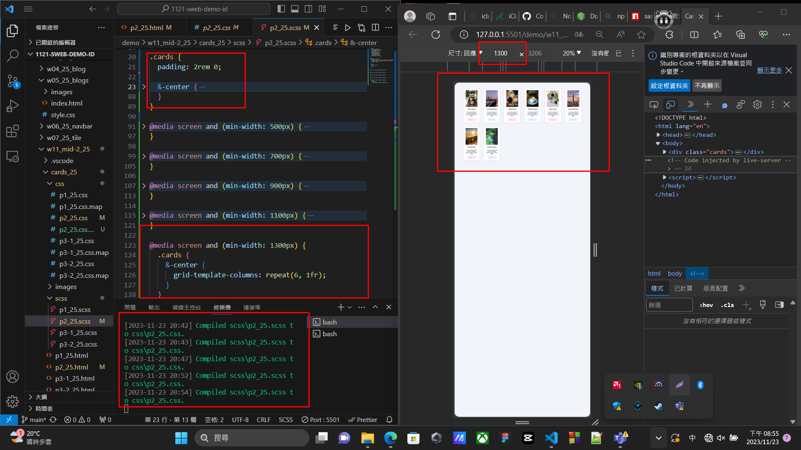
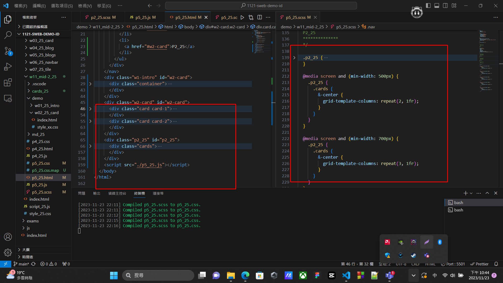
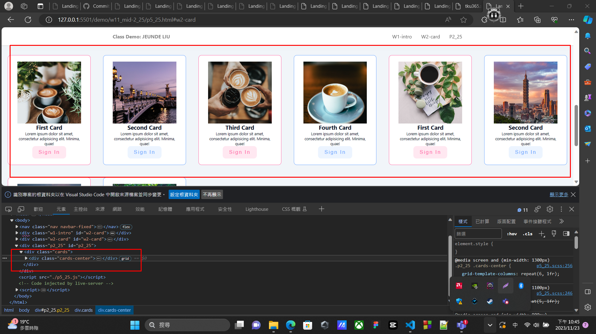
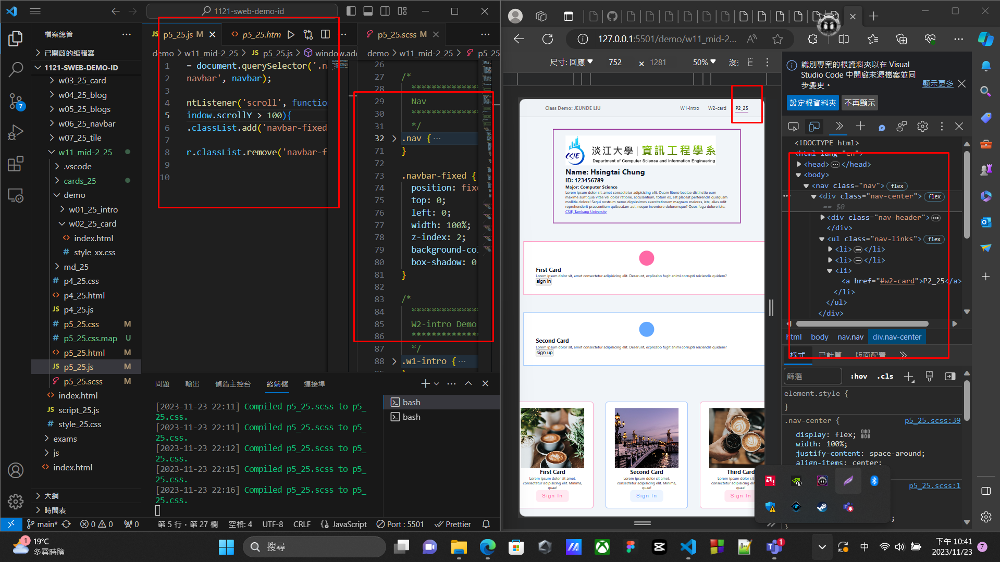
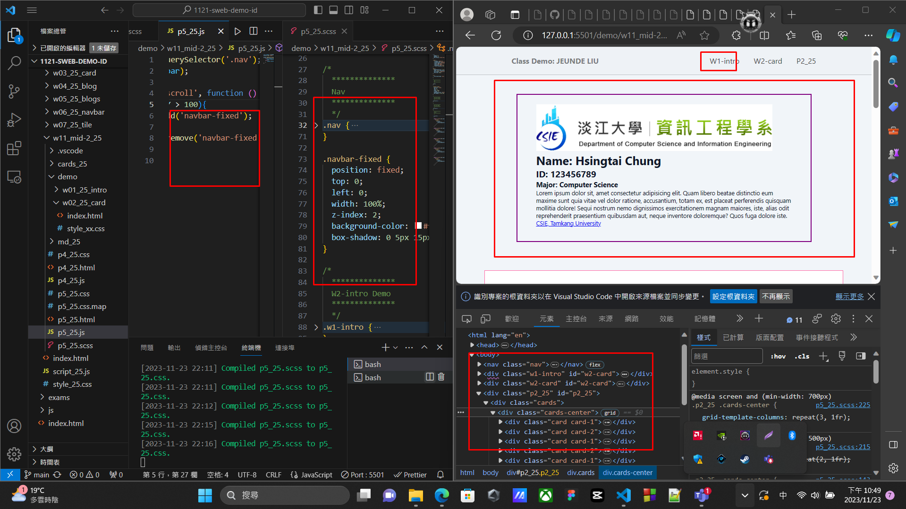

[github repo URL](https://github.com/der060738/1121-sweb-demo-212417025.git)


 ### W11-P1: Use scss to finish p1_xx
 

 
```
06d5e45 htchung Thu Nov 23 19:09:03 2023 +0800  W11-P1: Use scss to finish p1_xx
```

### W11-P2: Use scss to finish p2_xx (responsive)
 

 
```
efb433f htchung Thu Nov 23 20:00:19 2023 +0800  W11-P2: Use scss to finish p2_xx (responsive)
```

### W11-P3: Finish p5_xx by adding content in p2_25
 

 

 
```
587b422 htchung Thu Nov 23 20:55:34 2023 +0800  W11-P3: Finish p5_xx by adding content in p2_xx
```

W11-P4: Finish p5_25 by implement fixed navbar
 

 

 
```
1ab4276 htchung Thu Nov 23 21:08:04 2023 +0800  W11-P4: Finish p5_xx by implement fixed navbar
```
 