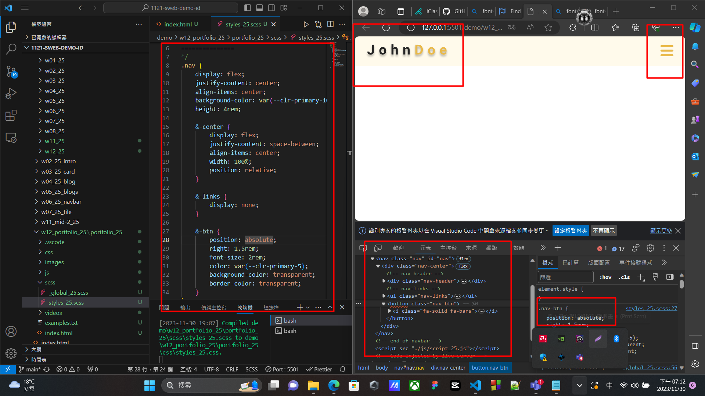
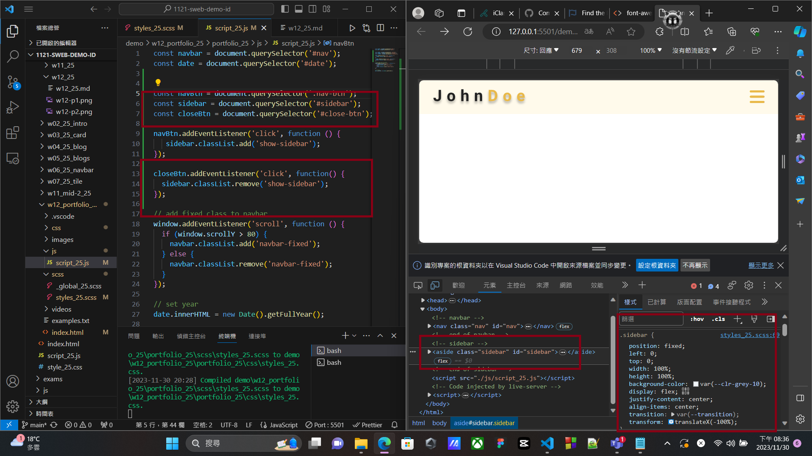

[github repo URL](https://github.com/der060738/1121-sweb-demo-212417025.git)

 ### W12-P1: Create menu bar with nav links missing
 

 
```
d5e81ff htchung Thu Nov 30 19:06:27 2023 +0800  W12-P1: Create menu bar with nav links missing
```

### W12-P2: Show nav-links when the screen is greater than 768px
 

 
```
8c78f73 htchung Thu Nov 30 19:35:53 2023 +0800  W12-P2: Show nav-links when the screen is greater than 768px
`

### W12-P3: Create sidebar by pressing nav-btn, remove sidebar by pressing close-btn
 

 

 
```
1c5ef93 htchung Thu Nov 30 20:25:20 2023 +0800  W12-P3: Create sidebar by pressing nav-btn, remove sidebar by pressing close-btn
```
 