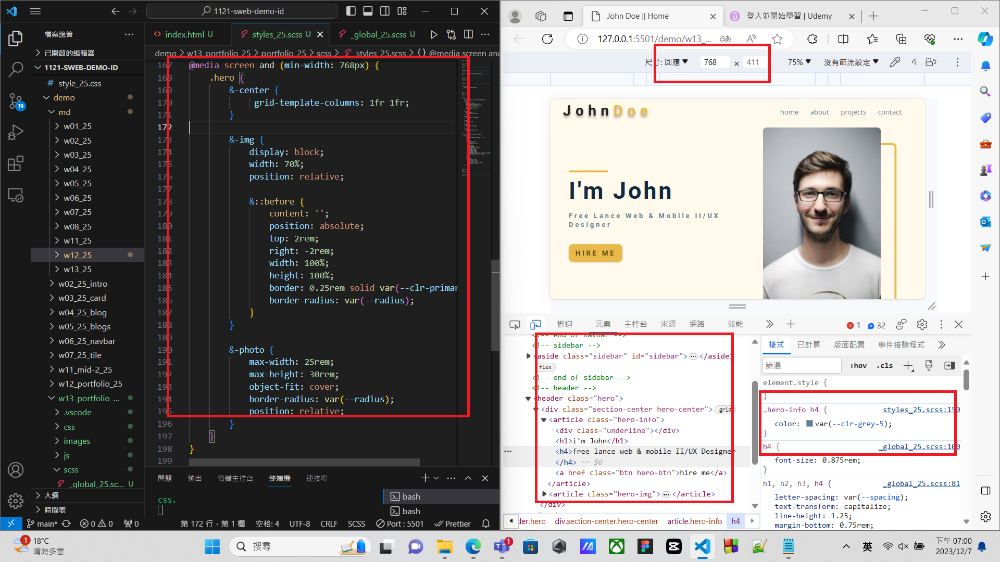
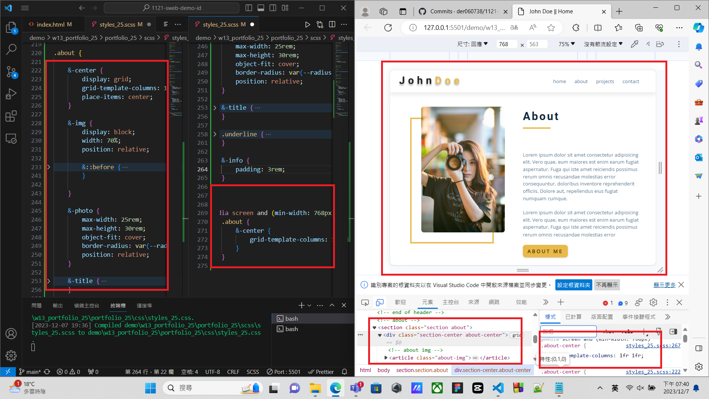

[github repo URL](https://github.com/der060738/1121-sweb-demo-212417025.git)

### W13-P1: Do hero section using grid of 2 columns
 

 
```
ce0ae00 htchung Thu Dec 7 18:57:38 2023 +0800   W13-P1: Do hero section using grid of 2 columns
```

### W13-P2: Do about section
 

 
```
c2192b9 htchung Thu Dec 7 19:41:34 2023 +0800   Do about section
```
 
 ### W13-P3: Do footer section
 

 
```
173bed1 htchung Thu Dec 7 20:04:23 2023 +0800   W13-P3: Do footer section
```

### W13-P4: Change index.html to demo.html in the root page
 

 
```
de4df8a htchung Thu Dec 7 20:31:13 2023 +0800   W13-P4: Change index.html to demo.html in the root page
```

 ### W13-P5: Use mega menu theme to show w03-card page
 

 
```
bbba57f htchung Thu Dec 7 21:21:34 2023 +0800   W13-P5: Use mega menu theme to show w03-card page
```

### W13-P6: W13 git logs
 

 
```
 
git log --pretty=format:"%h%x09%an%x09%ad%x09%s" --after="2023-12-06"
 
bbba57f htchung Thu Dec 7 21:21:34 2023 +0800   W13-P5: Use mega menu theme to show w03-card page
de4df8a htchung Thu Dec 7 20:31:13 2023 +0800   W13-P4: Change index.html to demo.html in the root page
173bed1 htchung Thu Dec 7 20:04:23 2023 +0800   W13-P3: Do footer section
c2192b9 htchung Thu Dec 7 19:41:34 2023 +0800   Do about section
ce0ae00 htchung Thu Dec 7 18:57:38 2023 +0800   W13-P1: Do hero section using grid of 2 columns
 
```
 
 