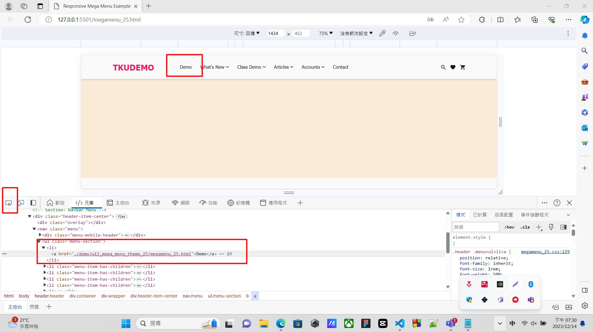
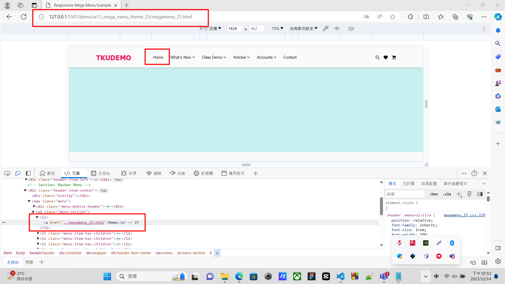
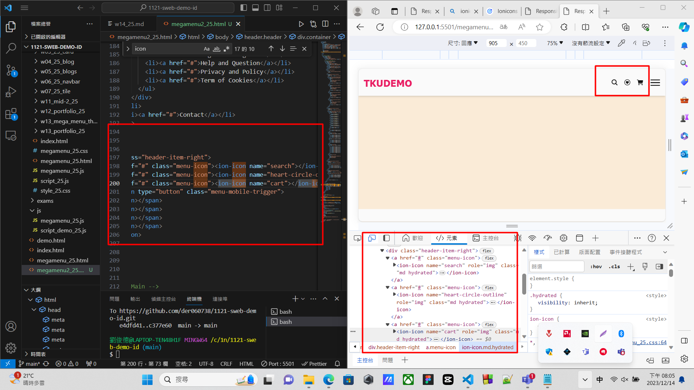
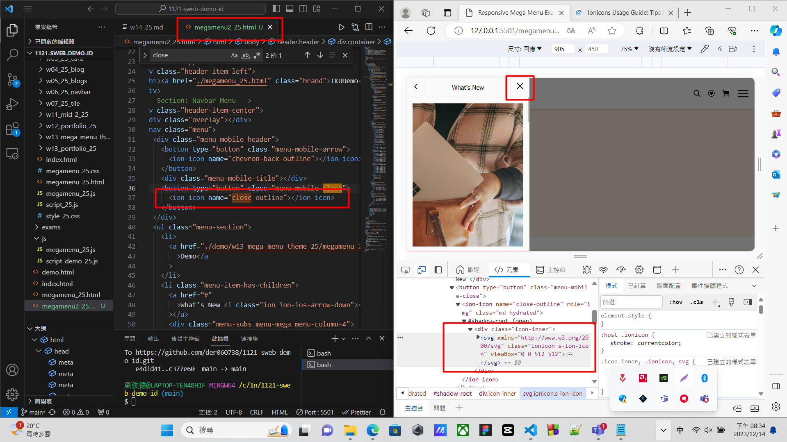
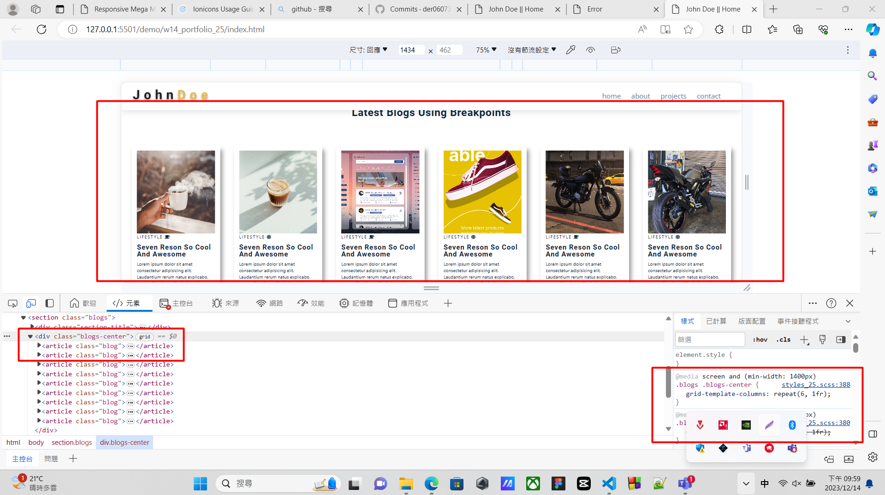
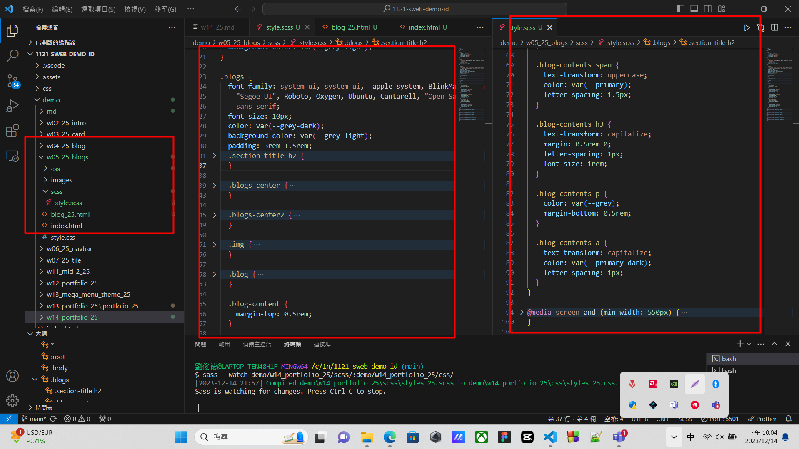
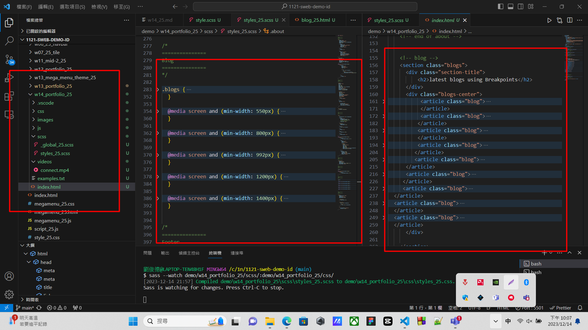
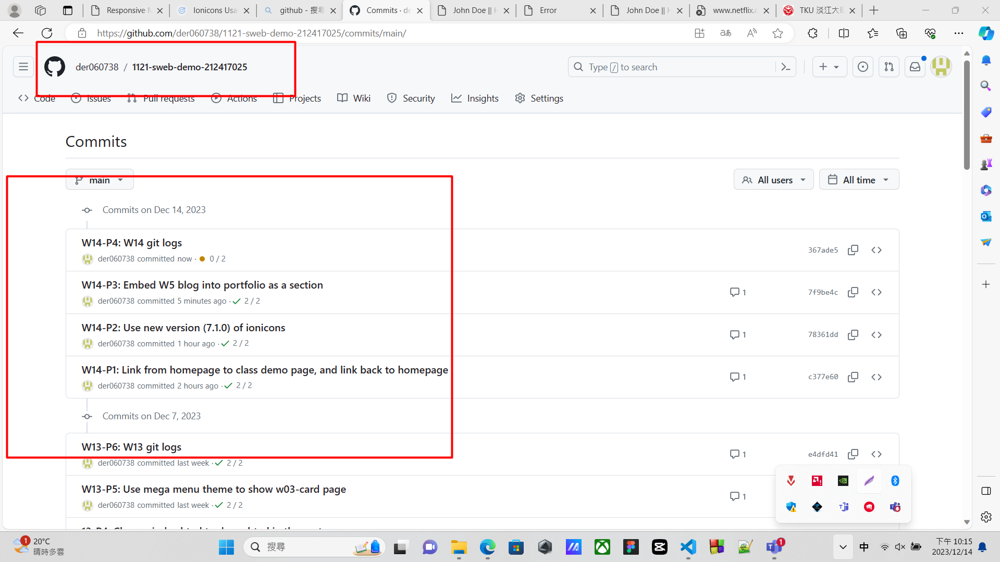

[github repo URL](https://github.com/der060738/1121-sweb-demo-212417025.git)

### W14-P1: Link from homepage to class demo page, and link back to homepage
 

 

 
```
6d76fb4 htchung Thu Dec 14 19:34:25 2023 +0800  W14-P1: Link from homepage to class demo page, and link back to homepage
```

### W14-P2: Use new version (7.1.0) of ionicons
 

 

 
```
f830d80 htchung Thu Dec 14 20:12:01 2023 +0800  W14-P2: Use new version (7.1.0) of ionicons
```

### W14-P3: Embed W5 blog into portfolio as a section
 

 

 

 
```
d323a2f htchung Thu Dec 14 21:23:25 2023 +0800  W14-P3: Embed W5 blog into portfolio as a section
```

### W14-P4: W14 git logs
 

 
```
git log --pretty=format:"%h%x09%an%x09%ad%x09%s" --after="2023-12-13"
 
7f9be4c der060738       Thu Dec 14 22:09:55 2023 +0800  W14-P3: Embed W5 blog into portfolio as a section
78361dd der060738       Thu Dec 14 20:36:55 2023 +0800  W14-P2: Use new version (7.1.0) of ionicons
c377e60 der060738       Thu Dec 14 19:59:34 2023 +0800  W14-P1: Link from homepage to class demo page, and link back to homepage 
```